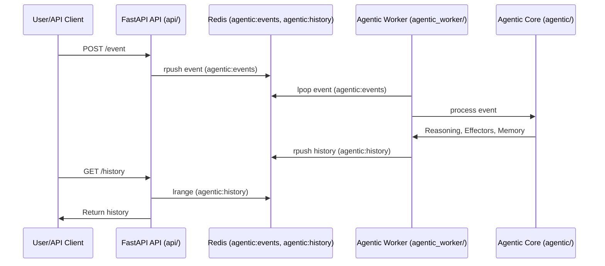
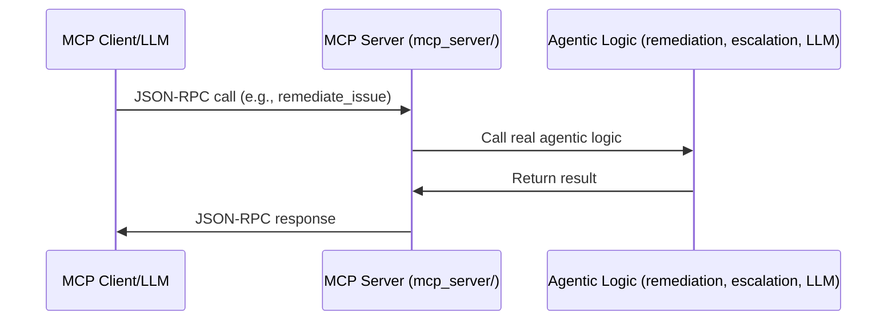

# AutoRemedy Architecture & Code Overview

## 1. Architecture Overview

AutoRemedy supports two architectures:
- **Legacy Script-Based (Monolithic)**: For quick prototyping or legacy use.
- **Modern Microservice (Dockerized)**: For scalable, production-ready, cloud-native deployments.

---

## 2. Legacy Script-Based Architecture

- **main.py** is the entrypoint.
- All components (job simulation, agent/orchestrator, resolution, notifications, LLM) run in a single process.
- No decoupling; not recommended for production.

**Flow:**
```
main.py
  └─> agent/orchestrator.py
        ├─> resolution/engine.py
        ├─> notifications/notifier.py
        ├─> jobsim/simulator.py
        └─> llm/llama3_client.py
```

---

## 3. Modern Microservice Architecture

- **api/**: FastAPI REST API service (Dockerized)
- **agentic_worker/**: Agentic worker service (Dockerized)
- **Redis**: Message broker and shared state store (Dockerized)
- **LM Studio (LLM)**: External service for Llama 3
- **agentic/**: Core agentic logic (shared by worker)

**Flow:**
- API receives events, pushes to Redis queue.
- Worker polls Redis, processes events, stores results/feedback in Redis.
- API provides endpoints for event submission, history, feedback, and status.

**Sequence Diagram (Mermaid):**


---

## 4. Redis Configuration & Usage

- **Redis is the backbone of the microservice architecture.**
- **Event Queue (`agentic:events`)**: API pushes new job events here. Worker pops and processes them.
- **History List (`agentic:history`)**: Worker appends processed event/action/outcome/feedback records here. API reads for `/history` endpoint.
- **Configuration**: Redis host/port/db are set via environment variables in both API and worker (`REDIS_HOST`, `REDIS_PORT`, `REDIS_DB`).
- **Decoupling**: Redis allows API and worker to scale independently and communicate asynchronously.

---

## 5. Component Breakdown

### **A. Sensors (`agentic/sensor_sim.py`, custom)**
- Fetch or receive job events (simulated or real)
- Can be extended to poll APIs, listen to webhooks, or read from files/databases

### **B. Agentic Loop (`agentic/agent.py`)**
- Orchestrates the perception (event ingestion), reasoning (decision-making), action (effectors), and learning (memory/feedback)
- Modular: sensors, effectors, and reasoning modules are pluggable

### **C. Reasoning Modules (`agentic/reasoning_llm.py`, `agentic/reasoning_simple.py`)**
- Decide what actions to take given an event and context
- LLMReasoningModule uses Llama 3 via LM Studio for log analysis and action suggestions
- SimpleReasoningModule uses rule-based logic
- Easily extendable for new reasoning strategies

### **D. Effectors (`notifications/notifier.py`, custom)**
- Execute actions (notify, escalate, remediate, etc.)
- Pluggable: add new effectors for email, Slack, ServiceNow, etc.

### **E. Memory (`agentic/memory.py`)**
- Records all events, actions, outcomes, and feedback
- Enables traceability, audit, and learning

### **F. LLM Client (`llm/llama3_client.py`)**
- Connects to LM Studio's OpenAI-compatible API for log analysis and recommendations
- Logs all LLM responses to `logs/llm_analysis.log` for traceability
- Configurable via `config.yaml`

### **G. Configuration (`config.yaml`)**
- Defines jobs, resolution steps, notification settings, and LLM parameters
- All logic is driven by config for maximum flexibility

### **H. Demo Entrypoint (`agentic/demo_run.py`)**
- Wires together sensors, effectors, reasoning modules, and memory for a working agentic demo
- Demonstrates feedback and learning loop

---

## 6. Logical Flow (Microservice)
1. **User/API Client** submits a job event via the API.
2. **API** pushes the event to Redis (`agentic:events`).
3. **Worker** polls Redis, processes the event using agentic core logic (LLM, rules, effectors).
4. **Worker** appends the result to Redis history (`agentic:history`).
5. **API** provides endpoints to query history, status, and submit feedback.

---

## 7. Project Structure

```
AutoRemedy/
├── api/
├── agentic_worker/
├── agentic/
├── notifications/
├── llm/
├── jobsim/
├── config.yaml
├── requirements.txt
├── main.py
├── logs/
└── docs/
```

---

## 8. Further Reading
- See `docs/README.md` for setup, usage, and extension instructions
- Review `logs/llm_analysis.log` for LLM-powered analysis history 

---

## 9. Multi-Agent Orchestration (New)

- **MultiAgentOrchestrator (`agentic/agent.py`)**: Manages multiple Agent instances, each with their own sensors, effectors, and reasoning modules.
- **Configuration**: Agents can be defined via config or code, each with independent memory and feedback.
- **Demo**: See `agentic/demo_run.py` for an example of running two agents in parallel.
- **Benefits**:
  - Enables parallel or specialized processing (e.g., one agent for logs, another for metrics)
  - Foundation for advanced autonomy (self-reflection, planning, collaboration)
  - Paves the way for Model Context Protocol (MCP) integration and plug-and-play agent/tool ecosystems

**Example Multi-Agent Flow:**
```
MultiAgentOrchestrator
  ├── Agent 1 (Sensor(s), Effector(s), Reasoning)
  └── Agent 2 (Sensor(s), Effector(s), Reasoning)
      ...
Each agent processes events independently, stores its own history, and can adapt based on feedback.
```

--- 

## 10. Self-Reflection & Planning Module (New)

- **SelfReflectionModule (`agentic/self_reflection.py`)**: Allows agents to analyze their own memory/history after each run.
- **Purpose**: Detect patterns such as repeated failures or ineffective remediations, and suggest strategy adjustments (e.g., escalate sooner, review remediation approach).
- **Integration**: Pass an instance of SelfReflectionModule to the Agent. After each event or batch, the agent calls `self_reflection.reflect(memory)` and updates its context with the suggestions.
- **Benefits**:
  - Enables agents to adapt and improve autonomously based on outcomes
  - Lays the foundation for multi-step planning and dynamic goal adjustment
  - Key step toward advanced autonomy and MCP-enabled collaboration

**Example:**
```
reflection = SelfReflectionModule(min_failures_for_escalation=2)
agent = Agent(..., self_reflection=reflection)
```

--- 

## 11. Model Context Protocol (MCP) Integration (New)

- **MCP Server (`mcp_server/mcp_adapter.py`)**: Exposes agentic tools (remediate, escalate, analyze_log) as MCP-compliant endpoints using JSON-RPC over HTTP.
- **Dynamic Tool Registry**: Tool schemas are loaded from `mcp_server/tool_schemas.yaml` for easy reconfiguration and extension.
- **Plug-and-Play**: Enables external LLMs, agents, or orchestrators to discover and invoke agentic actions in a standardized way.
- **Wiring**: MCP endpoints are directly connected to real agentic logic (remediation, escalation, LLM analysis).
- **Benefits**:
  - Standardizes tool/resource access for LLMs and agents
  - Enables cross-agent and cross-tool collaboration
  - Foundation for future multi-agent, multi-tool ecosystems

**MCP Sequence Diagram:**


**How to Run MCP Server:**
```bash
uvicorn mcp_server.mcp_adapter:app --reload --port 9000
```

**How to Test MCP Endpoints:**
- Use curl, Postman, or PowerShell to POST JSON-RPC requests to `http://localhost:9000/mcp`.
- See `mcp_server/tool_schemas.yaml` for available tools and schemas.

--- 