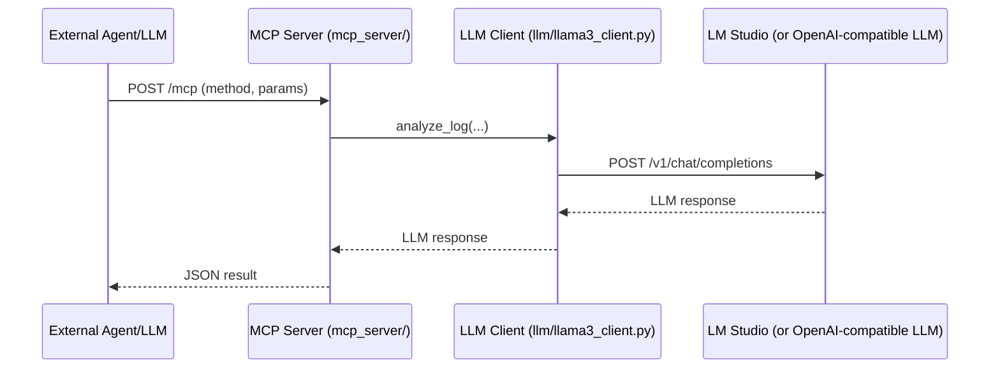

# AutoRemedy MCP Server: Architecture & Usage

---

## 1. What is MCP?

**MCP (Modular/Model Control Protocol)** is a protocol and server implementation that exposes agentic logic (remediation, LLM analysis, notification, etc.) as standardized, callable HTTP endpoints. This allows external agents, LLMs, or orchestration frameworks to use your system’s capabilities as “tools” or “skills” via a simple API.

---

## 2. Why Use MCP?

- **Interoperability:** Any external system (LLM, agent, workflow engine) can call your agentic logic without knowing your internal code.
- **Plug-and-Play:** Swap LLMs, effectors, or remediation logic by changing config, not code.
- **Extensibility:** Add new tools/effectors and expose them via MCP for others to use.
- **Standardization:** Follows a JSON-RPC-like pattern, making it easy to integrate with modern agent frameworks (LangChain, CrewAI, AutoGen, etc.).

---

## 3. How Does MCP Work in AutoRemedy?

### A. The MCP Server

- Implemented in `mcp_server/mcp_adapter.py` using FastAPI.
- Loads the same config and LLM client as the worker.
- Exposes endpoints for:
  - Remediation actions (`remediate_issue`)
  - LLM log analysis (`analyze_log`)
  - Notification/escalation (if extended)
- Accepts **JSON-RPC** style POST requests to `/mcp`.

### B. How the Local LLM is Registered

- **Registration is automatic and config-driven.**
- The LLM client is created with:
  ```python
  llm_client = Llama3Client(CONFIG)
  ```
- The `Llama3Client` reads the LLM endpoint from config/env:
  - In Docker: `LLM_ENDPOINT=http://host.docker.internal:1234/v1`
  - Locally: `LLM_ENDPOINT=http://localhost:1234/v1`
- This means **the MCP server will always use the LLM endpoint specified in your config/environment**—no manual registration needed.

### C. Request/Response Flow

**Request Example:**
```json
{
  "method": "analyze_log",
  "params": {
    "log_text": "Job failed due to out of memory.",
    "job_id": "job42"
  }
}
```

**Flow:**
1. MCP server receives this at `/mcp`.
2. Calls `llm_client.analyze_log(...)` (which sends the prompt to your local LLM).
3. Returns the LLM’s response in the HTTP reply.

**Response Example:**
```json
{
  "result": "The job failed due to insufficient memory. Suggested resolution: increase available memory or optimize the job's memory usage.",
  "success": true
}
```

### D. Sequence Diagram



---

## 4. How to Start and Use the MCP Server

### A. Start the Server
```bash
uvicorn mcp_server.mcp_adapter:app --reload --port 9000
```

### B. Call a Tool from Any Client
```python
import requests
response = requests.post("http://localhost:9000/mcp", json={
    "method": "remediate_issue",
    "params": {"job_id": "job1", "status": "fail", "details": {}}
})
print(response.json())
```

---

## 5. What Tools/Actions Are Exposed?

| Tool/Action      | Method Name        | Description                                 |
|------------------|-------------------|---------------------------------------------|
| Remediation      | remediate_issue   | Suggests or executes remediation steps      |
| LLM Analysis     | analyze_log       | Analyzes logs/events using the LLM          |
| Notification     | (extendable)      | Triggers notifications/escalations          |

---

## 6. How to Extend MCP in AutoRemedy

- **Add new tools:** Implement new functions in `mcp_adapter.py` and register them as endpoints.
- **Expose more agentic logic:** Any function (remediation, notification, feedback, etc.) can be exposed as a tool.
- **Integrate with external orchestrators:** Use frameworks like LangChain, CrewAI, or custom LLMs to call your MCP server.

---

## 7. How MCP Fits Into the Overall Architecture

- **MCP is a thin wrapper:** It exposes your agentic logic and LLM as HTTP tools.
- **No manual registration:** The LLM is “registered” to MCP by being the endpoint in your config.
- **You can swap LLMs:** Just change the endpoint in your config/env, restart MCP, and it will use the new LLM.
- **Works with both local and Docker setups:** MCP always uses the config-driven LLM endpoint.

---

## 8. References

- **File:** `mcp_server/mcp_adapter.py`
- **Docs:** See `docs/ARCHITECTURE.md`, `docs/RUNNING.md`
- **Example:** [LangChain Tool API](https://python.langchain.com/docs/modules/agents/tools/custom_tools/)

---

**If you want more examples, a code walkthrough, or want to see how to add a new tool, just ask!** 