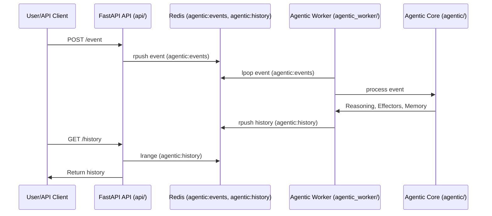

# AutoRemedy: Agentic AI for Autonomous IT Job Monitoring and Resolution

## Overview
AutoRemedy is a modular, agentic AI system for autonomous monitoring, detection, and resolution of IT jobs. It leverages a local LLM (Meta Llama 3 via LM Studio) for log analysis, diagnosis, and remediation suggestions. The system is designed for extensibility, configurability, and easy integration with real-world job schedulers and enterprise tools.

---

## Table of Contents
- [Features](#features)
- [Architecture Summary](#architecture-summary)
- [Code Understanding & Component Map](#code-understanding--component-map)
- [Sequence Diagrams](#sequence-diagrams)
- [Redis Usage & Logical Flow](#redis-usage--logical-flow)
- [Setup & Installation](#setup--installation)
- [How to Run: Script vs. Microservice](#how-to-run-script-vs-microservice)
- [Extending the System](#extending-the-system)
- [Troubleshooting & FAQ](#troubleshooting--faq)
- [Contributing](#contributing)
- [License](#license)

---

## Features
- **Agentic architecture** with pluggable Sensors, Effectors, and Reasoning Modules
- **LLM-powered reasoning** for log analysis and action planning (Llama 3 via LM Studio)
- **Feedback and learning loop** for continuous improvement
- **Extensible plugin system** for new integrations (job sources, notifications, remediation)
- **Structured logging and memory** for traceability and audit
- **Supports both legacy script and modern microservice architectures**

---

## Architecture Summary

### Modern Microservice Architecture
```
+-------------------+         +---------------------+         +-------------------+
|    FastAPI API    | <-----> |  Redis (Broker/DB)  | <-----> |   Agentic Worker  |
| (event, status,   |         | (Queue, History)    |         | (core logic, LLM, |
|  feedback, etc.)  |         |                     |         |  plugins, memory) |
+-------------------+         +---------------------+         +-------------------+
```

### Legacy Script-Based Architecture
```
main.py
  └─> agent/orchestrator.py
        ├─> resolution/engine.py
        ├─> notifications/notifier.py
        ├─> jobsim/simulator.py
        └─> llm/llama3_client.py
```

---

## Code Understanding & Component Map

- **api/**: FastAPI REST API service (Dockerized)
- **agentic_worker/**: Agentic worker service (Dockerized)
- **agentic/**: Core agentic logic (sensors, effectors, reasoning modules, memory)
- **notifications/**: Notification effectors (console, can be extended)
- **llm/**: LLM client for LM Studio
- **jobsim/**: Job simulation logic
- **config.yaml**: Central configuration
- **requirements.txt**: Python dependencies
- **main.py**: Legacy monolithic entrypoint (not used in microservices)

---

## Sequence Diagrams

### Microservice Event Flow (Mermaid Syntax)
> **Note:** The following is a Mermaid sequence diagram. If your Markdown renderer supports Mermaid, it will render as a diagram.



### Legacy Script Flow
```
main.py
  └─> JobAgent (agent/orchestrator.py)
        ├─> Simulate jobs (jobsim/simulator.py)
        ├─> Detect issues, call resolution/engine.py
        ├─> Use LLM (llm/llama3_client.py) for analysis
        └─> Notify/escalate (notifications/notifier.py)
```

---

## Redis Usage & Logical Flow

- **Event Queue (`agentic:events`)**: API pushes new job events here. Worker pops and processes them.
- **History List (`agentic:history`)**: Worker appends processed event/action/outcome/feedback records here. API reads for `/history` endpoint.
- **Decoupling**: Redis allows API and worker to scale independently and communicate asynchronously.

---

## Setup & Installation

1. **Install Python dependencies:**
   ```bash
   pip install -r requirements.txt
   ```
2. **Start LM Studio:**
   - Launch LM Studio and load the Llama 3 model
   - Enable the OpenAI-compatible API (default: `http://localhost:1234/v1`)
3. **Configure jobs and settings:**
   - Edit `config.yaml` to define jobs, resolution steps, and LLM settings

---

## How to Run: Script vs. Microservice

### A. Legacy Script-Based Approach
- **Run everything in one process (for quick prototyping or legacy use):**
  ```bash
  python main.py
  ```
- **Note:** This is not recommended for production or scalable deployments.

### B. Modern Microservice (Dockerized) Approach

#### 1. Start Redis (if not already running):
```bash
docker run -d -p 6379:6379 --name autoremedy-redis redis:7
```

#### 2. Build and Run the API Service
```bash
cd api
# Build Docker image (optional for local dev)
docker build -t autoremedy-api .
# Or run locally
uvicorn api.main:app --reload --host 0.0.0.0 --port 8000
```

#### 3. Build and Run the Agentic Worker
```bash
cd agentic_worker
# Build Docker image (optional for local dev)
docker build -t autoremedy-worker .
# Or run locally
python -m agentic_worker.main
```

#### 4. Test the API
- Open [http://localhost:8000/docs](http://localhost:8000/docs) for Swagger UI.
- Submit events, check history, and provide feedback.

#### 5. (Optional) Use Docker Compose
- You can orchestrate all services with a `docker-compose.yml` for local or cloud-native development.

---

## Extending the System

- **Add new sensors:** Subclass `Sensor` and implement `get_event()`
- **Add new effectors:** Subclass `Effector` and implement `execute()`
- **Add new reasoning modules:** Subclass `ReasoningModule` and implement `decide()`
- **Integrate real job schedulers:** Implement job adapters as sensors
- **Expand notifications:** Add new effectors for different channels
- **Tune LLM prompts:** Update prompt templates in `config.yaml`
- **Add persistent storage:** Store job state/history in a database for production use

---

## Troubleshooting & FAQ
- **No LLM logs?** Ensure LM Studio is running and accessible at the configured endpoint
- **No notifications?** Check effector registration and console output
- **Want to add a new integration?** See the Extending section above
- **Serialization errors?** Clear Redis queues and ensure all code is updated to use only JSON-serializable objects (dicts, not dynamic classes).

---

## Contributing
- Contributions are welcome! Please open issues or pull requests for new features, bug fixes, or documentation improvements.

---

## License
MIT (or your preferred license) 