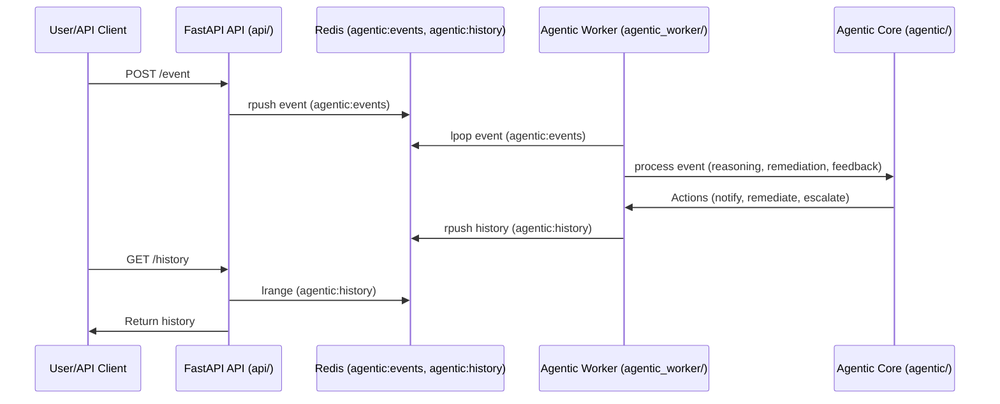
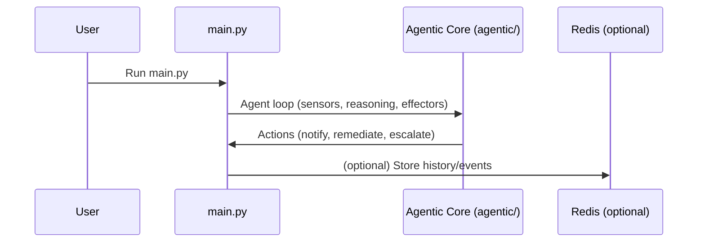

# AutoRemedy: Agentic Microservice Platform

## Overview
AutoRemedy is a modular, agentic system for automated event remediation, escalation, and feedback-driven learning. It is designed for microservice deployment (Docker, Kubernetes, OpenShift) and supports configuration-driven remediation, feedback loops, and extensibility. **Legacy script-based usage is also supported for quick prototyping or local runs.**

---

## Architecture

### Microservices
- **API Service (`api/`)**: FastAPI REST API for event ingestion, feedback, and history. Stateless gateway.
- **Agentic Worker (`agentic_worker/`)**: Processes events, applies reasoning (LLM/rules), triggers remediation/escalation/notification actions. All business logic lives here.
- **Redis**: Message broker and shared state store.

### Libraries/Plugins (Integrated in Services)
- **agentic/**: Core agent, sensors, effectors, reasoning modules (imported by worker).
- **remediation/**: Config-driven remediation engine and YAML rules (imported by worker).
- **feedback/**: Feedback store/adapter (imported by API and worker).
- **notifications/**: Notification effectors (imported by worker).
- **resolution/**: Action logic (imported by worker).
- **llm/**: LLM client (imported by reasoning module).

---

## Diagrams

### Microservice Event Flow


### Legacy Script Flow


---

## Event Flow
1. **Event Ingestion**: Events are POSTed to `/event` on the API service.
2. **Queueing**: API pushes events to Redis (`agentic:events`).
3. **Processing**: Agentic worker dequeues events, applies reasoning (LLM + config-driven remediation + feedback).
4. **Action**: Worker triggers effectors (notification, remediation, escalation) as needed.
5. **Feedback**: Users can POST feedback, which is stored and used to adapt future reasoning.

---

## Configuration-Driven Remediation
- **Rules are defined in `remediation/remediation.yaml`**.
- Each rule matches event patterns (type, status, source, description) and specifies a remediation action.
- No code changes needed to add/update/removal remediation logic—just edit the YAML file.

**Example rule:**
```yaml
- match:
    event_type: "job_issue"
    status: "fail"
    source: "DiskMonitor"
    description_contains: "Disk full"
  action: "clear_temp_files"
```

---

## Feedback Loop
- Feedback is submitted via the API and stored in Redis.
- The agentic worker retrieves feedback for similar events and adapts reasoning (e.g., prompt enrichment, rule adaptation).
- Feedback is used to improve future remediation and escalation decisions.

---

## Escalation
- Escalation is triggered if:
  - The LLM suggests escalation,
  - The event has `status: escalate` or `escalate: true`,
  - Or as configured in rules.
- Escalated events are logged to `logs/escalation.log` and highlighted in the console.

---

## Redis Usage & Management

### Queues and Data
- **Event Queue (`agentic:events`)**: Stores incoming events as JSON strings (from API or script).
- **History List (`agentic:history`)**: Stores processed event/action/outcome/feedback records as JSON.
- **Feedback Keys**: Feedback is stored as lists with keys like `feedback:event:<event_hash>`.

### Common Redis Commands
- **Clear event queue:**
  ```bash
  redis-cli DEL agentic:events
  ```
- **Clear history:**
  ```bash
  redis-cli DEL agentic:history
  ```
- **Add event to queue:**
  ```bash
  redis-cli RPUSH agentic:events '{"job_id": 1, "status": "fail", "event_type": "job_issue", "details": {"timestamp": "...", "source": "...", "description": "..."}}'
  ```
- **View event queue:**
  ```bash
  redis-cli LRANGE agentic:events 0 -1
  ```
- **View history:**
  ```bash
  redis-cli LRANGE agentic:history 0 -1
  ```
- **Clear all feedback:**
  ```bash
  redis-cli KEYS 'feedback:event:*' | xargs redis-cli DEL
  ```

### Data Format
- All data is stored as JSON-encoded strings.
- Events, actions, and feedback are always dictionaries/lists (never dynamic classes).

---

## Extensibility
- **Sensors**: Add new event sources by subclassing `Sensor` in `agentic/base.py`.
- **Effectors**: Add new effectors (e.g., Slack, PagerDuty) by subclassing `Effector`.
- **Reasoning Modules**: Swap or extend reasoning (LLM, rules) by subclassing `ReasoningModule`.
- **Remediation**: Add new remediation actions by editing `remediation.yaml`.

---

## Deployment

### Docker Compose Example
```yaml
version: '3.8'
services:
  redis:
    image: redis:6
    ports:
      - "6379:6379"
  api:
    build: ./api
    ports:
      - "8000:8000"
    depends_on:
      - redis
  worker:
    build: ./agentic_worker
    depends_on:
      - redis
```

### Kubernetes/OpenShift
- Deploy `api` and `agentic_worker` as separate Deployments.
- Use a Redis Deployment/Service.
- Add health/readiness probes as needed.

---

## Legacy Script-Based Usage
- You can still run the legacy script for quick prototyping or local runs:
  ```bash
  python main.py
  ```
- This will run the agentic loop in a single process, using the same core logic and configuration as the microservices.
- Redis is optional in this mode, but can be used for history/queueing if desired.

---

## Testing
- Automated tests in `tests/` cover API, feedback, escalation, and config-driven remediation.
- Run tests locally before deployment.

---

## Directory Structure
- `api/`: FastAPI microservice
- `agentic_worker/`: Agentic worker microservice
- `agentic/`: Core agent logic (imported)
- `remediation/`: Remediation engine/config (imported)
- `feedback/`: Feedback logic (imported)
- `notifications/`: Notification effectors (imported)
- `resolution/`: Action logic (imported)
- `llm/`: LLM client (imported)
- `tests/`: Automated tests
- `logs/`: Log files
- `docs/`: Documentation

---

## How to Add New Functionality
- **New remediation rule**: Edit `remediation/remediation.yaml`.
- **New effector**: Add a class in `notifications/` and register in the worker.
- **New sensor**: Add a class in `agentic/` and register in the worker.
- **New feedback logic**: Extend `feedback/` and import as needed.

---

## Contact & Contribution
- See `docs/ARCHITECTURE.md` for detailed diagrams and sequence flows.
- Contributions welcome! Fork, branch, and submit PRs. 

---

## Multi-Agent Orchestration (New)

- **MultiAgentOrchestrator**: Run multiple agents in parallel, each with their own sensors, effectors, and reasoning modules.
- **Configuration**: Define agents in code or config, each with independent memory and feedback.
- **Demo**: See `agentic/demo_run.py` for a working example.
- **Benefits**:
  - Parallel/specialized event processing
  - Foundation for advanced autonomy and MCP integration

**How to Run Multi-Agent Demo:**
```bash
python agentic/demo_run.py
```
This will run two agents in parallel, each processing events and storing their own history/feedback.

--- 

## Self-Reflection & Planning Module (New)

- **SelfReflectionModule**: Lets agents analyze their own memory/history after each run.
- **Usage**: Pass an instance to the Agent. After each event or batch, the agent calls `self_reflection.reflect(memory)` and updates its context.
- **Benefits**:
  - Detects repeated failures or ineffective remediations
  - Suggests escalation or strategy review automatically
  - Enables agents to adapt and improve autonomously

**How to Use:**
```python
from agentic.self_reflection import SelfReflectionModule
reflection = SelfReflectionModule(min_failures_for_escalation=2)
agent = Agent(..., self_reflection=reflection)
```

--- 

## Model Context Protocol (MCP) Integration (New)

- **MCP Server**: Exposes agentic actions (remediate, escalate, analyze_log) as JSON-RPC endpoints for LLMs and external agents.
- **Dynamic Tool Registry**: Tool schemas are loaded from `mcp_server/tool_schemas.yaml`.
- **Plug-and-Play**: Enables standardized, discoverable tool access for LLMs and agentic orchestrators.

**How to Run:**
```bash
uvicorn mcp_server.mcp_adapter:app --reload --port 9000
```

**How to Test:**
- Use curl, Postman, or PowerShell to POST JSON-RPC requests to `http://localhost:9000/mcp`.
- Example (PowerShell):
  ```powershell
  Invoke-WebRequest -Uri http://localhost:9000/mcp -Method POST -Headers @{"Content-Type"="application/json"} -Body '{"jsonrpc":"2.0","method":"remediate_issue","params":{"job_id":"job42","status":"fail","details":{"error":"disk full"}},"id":2}'
  ```
- See `mcp_server/tool_schemas.yaml` for available tools and schemas.

**Benefits:**
- Standardizes tool/resource access for LLMs and agents
- Enables cross-agent and cross-tool collaboration
- Foundation for future multi-agent, multi-tool ecosystems

--- 